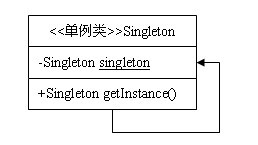

单例模式

定义：确保一个类只有一个实例，而且自行实例化并向整个系统提供这个实例。

类型：创建类模式

类图：

类图知识点：

1.类图分为三部分，依次是类名、属性、方法

2.以<<开头和以>>结尾的为注释信息

3.修饰符+代表public，-代表private，#代表protected，什么都没有代表包可见。

4.带下划线的属性或方法代表是静态的。

单例模式应该是23种设计模式中最简单的一种模式了。它有以下几个要素：

私有的构造方法
指向自己实例的私有静态引用
以自己实例为返回值的静态的公有的方法
单例模式根据实例化对象时机的不同分为两种：一种是饿汉式单例，一种是懒汉式单例。饿汉式单例在单例类被加载时候，就实例化一个对象交给自己的引用；而懒汉式在调用取得实例方法的时候才会实例化对象。代码如下：

饿汉式单例

    public class Singleton {
        private static Singleton singleton = new Singleton();
        private Singleton(){}
        public static Singleton getInstance(){
            return singleton;
        }
    }
懒汉式单例

    public class Singleton1 {
        private static Singleton singleton;
        private Singleton(){}

        public static synchronized Singleton getInstance(){
            if(singleton==null){
                singleton = new Singleton();
            }
            return singleton;
        }
    }
单例模式的优点：

在内存中只有一个对象，节省内存空间。

避免频繁的创建销毁对象，可以提高性能。

避免对共享资源的多重占用。

可以全局访问。

适用场景：由于单例模式的以上优点，所以是编程中用的比较多的一种设计模式。我总结了一下我所知道的适合使用单例模式的场景：

需要频繁实例化然后销毁的对象。

创建对象时耗时过多或者耗资源过多，但又经常用到的对象。

有状态的工具类对象。

频繁访问数据库或文件的对象。

以及其他我没用过的所有要求只有一个对象的场景。

单例模式注意事项：

只能使用单例类提供的方法得到单例对象，不要使用反射，否则将会实例化一个新对象。

不要做断开单例类对象与类中静态引用的危险操作。

多线程使用单例使用共享资源时，注意线程安全问题。
